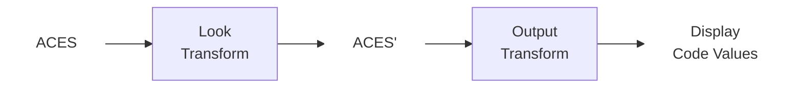

<!-- SPDX-License-Identifier: Apache-2.0 -->
<!-- Copyright Contributors to the ACES Project -->

# ACES Look Transforms

ACES Look Transforms, or Look Modification Transforms (LMTs), provide a
mechanism for applying creative or stylistic adjustments to ACES images. A Look
Transform modifies the default appearance produced by an Output Transform,
enabling customized looks that can be reused as alterative starting points on
ACES projects.

Formally, LMTs are defined as ACES-to-ACES transformations, though intermediate
encodings may be used internally when specific color operations require it. In
the process diagram, the output of an LMT is referred to as ACES' ("ACES
prime"), which is subsequently processed Output Transform.  

More information about designing and using Look Transforms can be found in the
[ACES Documentation](https://docs.acescentral.com/).

## Contributing

Before the project can accept any code submissions through GitHub, you must fulfill these prerequisites:

1. **Contributor License Agreement (CLA):** All contributors **must** have a signed CLA on file to ensure the project can freely use your contributions.

2. **Developer Certificate of Origin (DCO):** All commits **must** be signed off (e.g., `git commit -s`) to verify that you have the right to submit the code.

3. **AI Assistance Disclosure:** While not currently blocked by CI checks, any commits or PRs built with AI assistance are expected to include an `Assisted-by: TOOL/MODEL` line to maintain transparency and human accountability.

Please see [Contributing Guidelines](https://github.com/aces-aswf/.github/blob/main/CONTRIBUTING.md) for more details.

## Reporting Issues

### General Issues
To report a problem with any Look Transforms, please open an
[issue](https://github.com/aces-aswf/aces-look/issues) in this repository.

### Security
If the issue is sensitive in nature or a security related issue, please do not
report in the issue tracker. Instead refer to [SECURITY](https://github.com/aces-aswf/.github/blob/main/SECURITY.md) for more information about the project security policy.

## Governance

This repository is part of ACES, a project governed by the Academy Software Foundation.

For details about how the ACES project operates, please see
[GOVERNANCE](https://github.com/aces-aswf/.github/blob/main/GOVERNANCE.md).

## License

The ACES Project is licensed under the [Apache 2.0 license](./LICENSE).